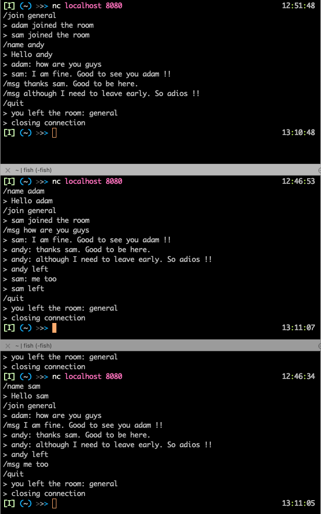

## simple-chat
A lightweight simple tcp chat server

### Usage

- Start the server
```bash
go run .
```

- connect to the server from multiple terminals (multiple clients)
```
nc localhost 8080
```

#### Client Comands

* set a name
  ```bash
  /name sam
  ```
* list available rooms
  ```bash
  /rooms
  ```
* join a room
  ```bash
  /join general
  ```
* broadcast a message
  ```bash
  /msg Hello people..
  ```
* quit
  ```
  /quit
  ```

#### Screens



